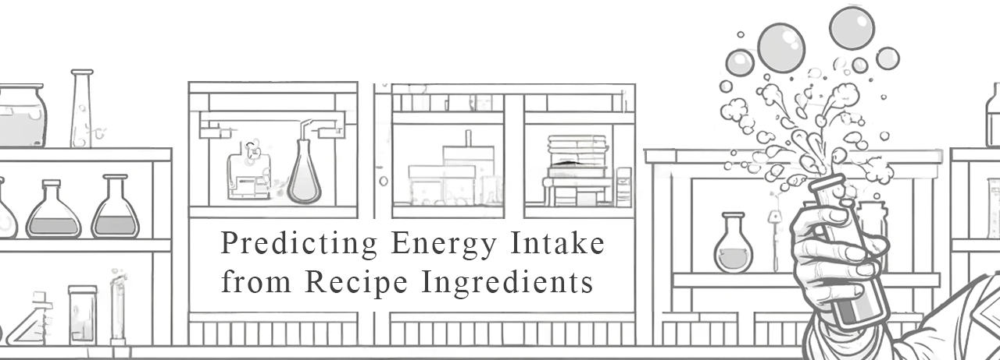
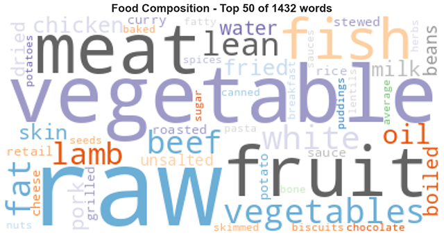
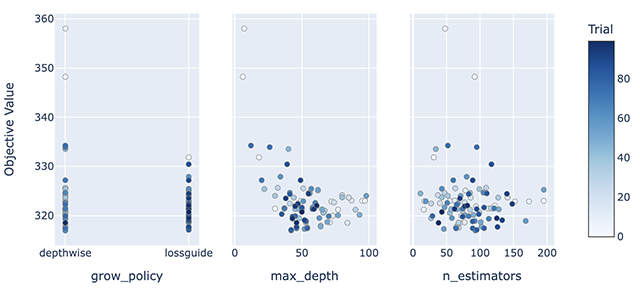
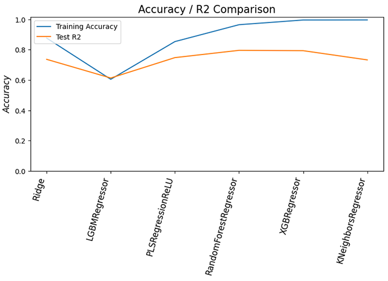

# Predicting Energy Intake from Recipe Ingredients

## Project Overview

This project aims to investigate the feasibility of machine learning in 
effectively predicting the energy, or calorie content, of ingredients used in recipes. Every year 
millions of people are affected by health conditions related to diet and nutrition. Research show that it is often a struggle to 
access the right information to make informed decisions about their food choices. There are many 
industries who are reliant on providing accurate nutritional information to consumers, yet this 
is not always available due to the complexity of food composition and preparation.

Overall, a 79.5% accuracy has been achieved on predicting the calorie content, Energy (kJ) / per 
100g, of food ingredient on a broad set of 2893 food ingredients. This is a significant step forward in 
achieving wider goals of predicting a broader spectrum of nutritional attributes.

The project consists of a [Jupyter notebook](notebook.ipynb "Jupyter notebook"), [model card](model_card.md "model card") and 
[datasheet](data_sheet.md "data sheet"). The original dataset is provided alongside the permutations used for the project.

## Rationale

The use of machine learning for the application of nutritional prediction in both personal and 
commercial settings can have far-reaching benefits:

- **Dietary Management and Nutrition**: For individuals tracking their caloric intake for 
   weight management or health conditions such as diabetes, accurate information on calorie 
   content can help in making informed dietary choices. This can assist in maintaining or 
   achieving a balanced diet.

- **Labelling and Packaging**: Accurate calorie predictions can aid food manufacturers in 
   providing precise nutritional information on packaging, which is crucial for consumer 
   transparency and regulatory compliance.

- **Food Service Application**: Chefs and food service professionals can use calorie content 
   predictions to design meals that meet specific nutritional criteria, which is especially 
   useful in settings like hospitals, schools, and health-focused restaurants and supermarkets.

- **Food Technology**: Integrating calorie prediction algorithms into apps and devices can 
   enhance the functionality of kitchen gadgets and fitness trackers, making them more useful 
   for consumers aiming to monitor their overall fitness and health.

- **Research and Development**: For researchers focusing on food science and human nutrition, 
   understanding the caloric content can help in studying the impacts of various foods on human 
   health and in developing new food products that fit into healthier lifestyle choices.

- **Personalised Nutrition**: With advances in personalised medicine, predicting calorie 
   content can be part of broader efforts to tailor diets to individual genetic profiles, 
   lifestyle factors, and health goals.

- **Reducing Food Waste**: Knowing the caloric value of ingredients can also aid in better 
   managing food resources, planning meals more efficiently, and reducing waste by utilising 
   ingredients appropriately according to dietary needs.

Overall, the ability to predict calorie content accurately can contribute significantly to 
health and wellness, culinary practices, consumer technology, and broader scientific research.

Assistive technology such as this can be used to improve the health conditions of many around 
the world and this project simply scratches the surface of the potential use of machine 
learning in the field of nutrition.

## Research

The research undertaken to form the basis of this project is wholly inspirational. Since the 1940's 
nutritional data has been collected on food ingredients and their composition by the science 
community, resulting in a highly detailed dataset which only this project hardly scratches the 
surface of. This has been compiled and maintained by government bodies many years now. Please 
review the [datasheet](data_sheet.md "data sheet") for more detailed information.

## Data Sources and Content

The dataset used for this analysis is the 'McCance and Widdowson’s The Composition of Foods 
Integrated Dataset 2021' and is provided by Public Health England. It contains detailed 
nutritional information for 2889 ingredients across 14 product categories. The dataset includes categorical 
data and scientific nutrient composition for each ingredient, making it highly suitable for 
practical application including machine learning models to predict nutritional value.

The data is sourced from [Public Health England](https://www.gov.uk/government/publications/composition-of-foods-integrated-dataset-cofid "Public Health England"), 
featuring 
ingredients 
that have undergone significant testing due to changes in food composition driven by new farming 
and manufacturing practices, public health initiatives, and variations in preparation and cooking methods.

Please see this [datasheet](data_sheet.md "data sheet") for more detailed information on the dataset and the 
elements used within this project.

## Methodology

The project is broken down into the following steps:

1. Obtaining the data set for the analysis 
2. Exploration, cleaning and pre-process the data 
3. Dimension reduction and feature engineering 
4. Determine the machine learning task 
5. Partition the data 
6. Choosing the machine learning techniques 
7. Training the models and using on a test dataset 
8. Interpreting the results 
9. Deploying in a sample technique

During the data pre-processing phase, I have vectorized words associated with food names and groups 
to make them more generalisable to a broader spectrum of targets. The aim of this project was to develop a machine learning model capable of adapting to a wide range of recipes and ingredients, thereby reducing its specificity to unseen data. The implementation details are shown below.

## Model evaluation

Many supervised machine learning models have been considered for this project, including:

- Principal Component Analysis (PCA) with Linear Regression
- Ridge Regression
- Regression using LightGBM
- Partical Least Squares Regression with ReLU Activation
- Random Forest Regressor
- XGBoost for Regression
- Support Vector Regression with and without PCA
- K-Nearest Neighbours Regressor

During the experimental phase, I discovered that employing Principal Component Analysis (PCA) 
actually 
reduced accuracy due to the high specificity required by the data. Using Linear Regression alone yielded poor results. Surprisingly, even Support Vector Regression, typically lauded for its effectiveness in high-dimensional regression tasks, also underperformed. This led me to focus on six other models for more in-depth analysis.

## Hyperparameter Optimisation

The models were extensively hyperparameter tuned using Optuna to ensure the best possible 
parameter selection for choosing a suitable model. 

Various models such as LightGBM were very slow to train and optimise, but others could be run 
through hundreds of iterations to find the optimum parameters.

## Model results

The following models were evaluated using Mean Squared Error (MSE), Root Mean Squared Error (RMSE), R-squared (R2), and Variance:

|                       |   Train_Accuracy |   Train_RMSE |      MSE |    RMSE |       R2 |   Variance |
|:----------------------|-----------------:|-------------:|---------:|--------:|---------:|-----------:|
| Ridge                 |         0.876683 |       220.49 |   119161 | 345.197 | 0.736364 |   0.736896 |
| LGBMRegressor         |          0.60461 |      394.813 |   174858 |  418.16 | 0.613138 |   0.613219 |
| PLSRegressionReLU     |         0.853306 |      240.483 |   114106 | 337.796 | 0.747548 |   0.748999 |
| RandomForestRegressor |         0.964715 |      117.943 |  92345.8 | 303.884 | 0.795691 |   0.795889 |
| XGBRegressor          |         0.995696 |      41.1924 |  93359.7 | 305.548 | 0.793447 |    0.79366 |
| KNeighborsRegressor   |         0.996304 |      38.1712 |   120835 | 347.614 |  0.73266 |   0.733781 |

The following are findings related to the model evaluation:

1. **Ridge Regression**:
   - Moderate training accuracy
   - Moderate RMSE values on both training and test data
   - Good (R2) score, indicating a decent amount of variance explained

2. **LGBMRegressor**:
   - Lower training accuracy
   - Higher RMSE values, indicating larger errors
   - Lower (R2) score, which shows it explains less variance relative to other models

3. **PLSRegressionReLU**:
   - High training accuracy
   - Moderate RMSE values
   - Very good (R2) score, indicating that it explains a substantial amount of variance

4. **RandomForestRegressor**:
   - Very high training accuracy
   - Lowest RMSE values among all models, showing smaller prediction errors
   - The highest (R2) score, indicating the best performance in terms of explaining variance

5. **XGBRegressor**:
   - Extremely high training accuracy
   - Very low training RMSE but slightly higher test RMSE compared to RandomForestRegressor
   - High (R2) score, similar to RandomForestRegressor but slightly lower

6. **KNeighborsRegressor**:
   - Highest training accuracy
   - Very low training RMSE but higher test RMSE, indicating possible overfitting
   - Lower (R2) score compared to RandomForestRegressor and XGBRegressor

The following graph shows the Accuracy against R2 score of the models:

Overall, there is a good level of accuracy from most of the models. The **RandomForestRegressor** 
appears to be the best choice based on its exceptionally high accuracy, the lowest error metrics (RMSE and MSE), and the highest R2. XGBRegressor is a close second, with excellent performance across all metrics, but slightly lower accuracy and would be a good choice in the case of overfitting.

Please see this [model card](model_card.md "model card") for more detailed information on the final 
model used within this project.

### Conclusion

This research project employs sophisticated machine learning techniques to predict the calorie 
content of various food ingredients, a crucial endeavour for nutrition management and public 
health. It has been proved feasible that machine learning could be practical for use in this 
field with scope to delve deeper into potential practical implementations.

Future work might include merging models and/or refining feature engineering to enhance predictions and expand the range of ingredients covered across a broader demographic. Additionally, there is potential to delve deeper into the data, improve word classification, and implement different tokenization methods, such as stemming and lemmatization, to interpret words in their contextual forms. These advancements could increase the model's applicability and accuracy.

### Author
- Adam de Zoete [(@zootle)](https://github.com/zootle "Adam de Zoete (@zootle)")

### License

This project is licensed under the MIT License - see the [LICENSE](LICENSE "license") file for 
details

